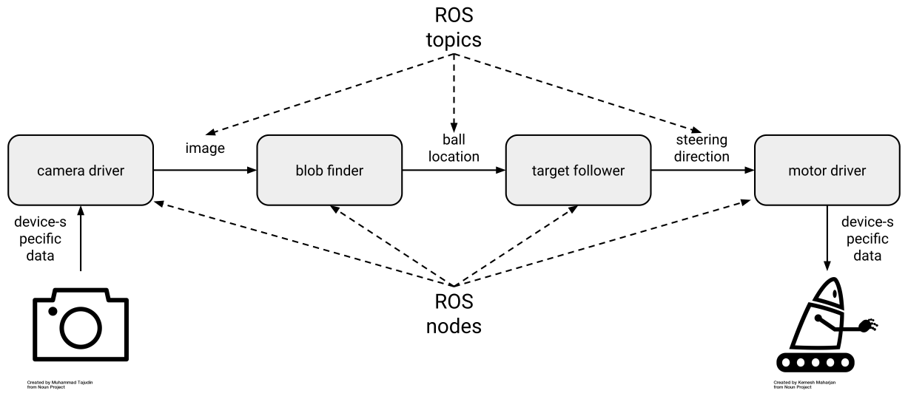

# Ros2 

## 1. ROS Concepts and Design Patterns
> https://osrf.github.io/ros2multirobotbook/ros2_design_patterns.html

- `Topics` and `Types`
  - nodes publish and subscribe via topics, each of which has a name and a type
- `Services`
  - form of remote procedure call(RPC)
  - service is implemented using a pair of ROS messages(request & reply)
  - infrequent, on-demand interactions among nodes, ROS services are a good choice.
- `Actions`
  - for goal-oriented, time-extended tasks.(compare with service)
  - action is defined by 3 ROS messages(`goal`, `result`, `feedback`)
  - on-demand, long-running behaviors, ROS actions are a good choice.
- `Parameters`
- `Callbacks`

## 2. Nodes
- Subprograms in your application, responsible for only one thing.
- Combined into a graph
- Communicate with each other through `topics`, `services`, and `parameters`.
- Fault tolerance.
- 패키지 안에 존재
